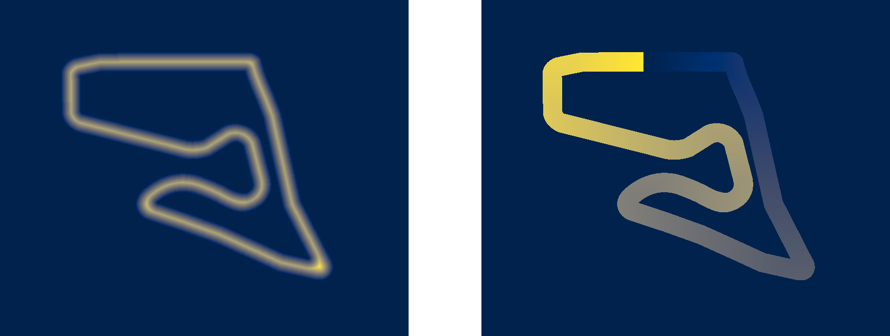
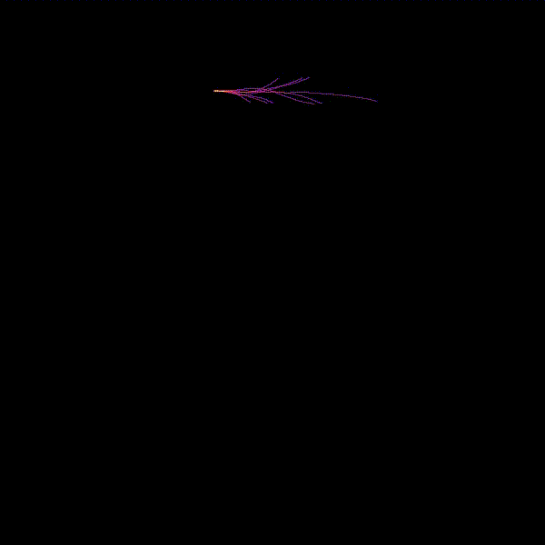
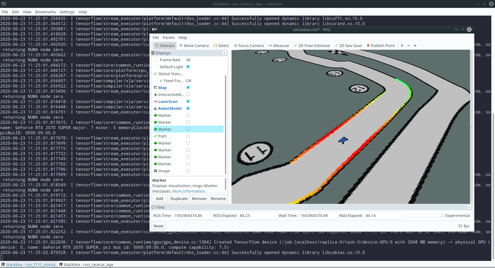

**VU Autonomous Racing Cars (2020S) - TU Wien**

**Team 3**

Stefan Adelmann | Hannes  Brantner | Daniel Lukitsch | Thomas Pintaric

------

# Lab 8: Reinforcement Learning

<u>This lab assignment had two parts:</u>

1. Write or adapt an [existing](https://github.com/f1tenth/f1tenth_gym/tree/master/gym) [OpenAI Gym environment](https://gym.openai.com/envs/) for training a F1/Tenth racecar steering controller using a chosen Reinforcement Learning (RL) algorithm. Specify the observation and action spaces, devise an appropriate reward function, and select meaningful model hyperparameters.
2. Deploy the trained controller in a ROS node, such that the simulated racecar drives autonomously around a given track (to be selected from a set of provided tracks).

## Implementation details

### Model training

As part of our solution, we provide a [rewritten version of the F1/Tenth Simulator](https://github.com/pintaric/f1tenth_simulator) (private GitHub repository, link might be inaccessible) that uses [gRPC](https://grpc.io/) to interface with OpenAI Gym and fixes several bugs and issues (not listed here) present in the ["legacy" F1/Tenth simulator](https://github.com/f1tenth/f1tenth_gym/tree/master/src). The source code is also available under [simulator/](simulator/) and should be built using the build script [simulator/build_release.bash](simulator/build_release.bash).Be aware that the build process can take a long time, due to various third-party libraries being compiled as part of the build process.

We recommended using a pre-built Docker container (available from [Docker Hub](https://hub.docker.com/repository/docker/pintaric/f1tenth_simulator)):

```bash
docker pull pintaric/f1tenth_simulator:0.1.0
docker run -it --rm -p 50051:50051 pintaric/f1tenth_simulator:0.1.0
```

In a separate BASH shell, execute the following command to start the training:

```bash
cd gym

# Create a Python 3.7.6 virtual environment named 'tuw_arc_lab8'
# (we assume that pyenv is installed on the system)
pyenv virtualenv 3.7.6 tuw_arc_lab8
pyenv local tuw_arc_lab8

# Install dependencies
pip3 install -r ./requirements.txt

# Start training (will run until interrupted by CRTL+C)
python3 ./train_with_tensorforce.py
```

Our training script [gym/train_with_tensorforce.py](gym/train_with_tensorforce.py) uses the [Tensorforce Reinforcement Learning Framework](https://tensorforce.readthedocs.io/en/latest/) to train a steering controller using [Proximal Policy Optimization (PPO)](https://openai.com/blog/openai-baselines-ppo) with a two-hidden-layer CNN backend. (See next section for details.)

We did not set a maximum number of training episodes. The script will run until interrupted by SIGINT (Crtl+C).

We recommend training for about 5-10K episodes on any of the `f1_*` tracks. The trained model will be written to [gym/trained_models](gym/trained_models) upon termination and should be deployed (manually) to [ros/racecar_agent/models](ros/racecar_agent/models) prior to running the `racecar_agent` ROS node (see below).

### RL algorithm

After considering multiple suitable RL algorithms, including [TRPO](https://arxiv.org/abs/1502.05477) and [Deep Q-Learning](https://www.nature.com/articles/nature14236), we chose do train our agent using **Proximal Policy Optimization (PPO)**, which is a *stochastic actor-critic policy gradient method*. A good introduction to PPO can be found in [Jonathan Hui's article on Medium.com](https://medium.com/@jonathan_hui/rl-proximal-policy-optimization-ppo-explained-77f014ec3f12), and in the [paper by Schulman et al.](https://arxiv.org/abs/1707.06347)

In our implementation, we use a **continuous high-dimensional observation space** and **continuous scalar action space**:

**Observation space:** 120 laser scan rays (equidistantly spaced) in the range [-180, +180] degrees.
**Action space:** Vehicle steering angle in the range [-0.4189, +0.4189] radians.

We parametrized the model to use a shared ConvNet*-block (2 hidden layers of size 64) followed by separate output layers for the actor and critic.

(*) ConvNet = Convolutional Neural Network

We chose a ConvNet over a fully-connected network (MLP = Multilayer Perceptron) due to the presence of *spatial correlation* in the entries of observation vector (i.e. neighboring LIDAR rays).

In order to facilitate state space exploration, we added a small amount of (Gaussian) noise to the action outputs (=*"action noise"*).

The training batch size was adjusted to 10 episodes, which means the ConvNet weights are updated every tenth episode. A small batch size was chosen because the relevant Machine Learning literature has found that that using smaller batch sizes tends to achieve the  best training stability and generalization performance.

For the stochatic gradient descent, we use the [ADAM optimizer](https://www.tensorflow.org/api_docs/python/tf/keras/optimizers/Adam), which is Tensorforce's default PPO optimizer, with an adjusted learning rate of 0.0025.

### Reward shaping

The design of the reward function is the most crucial part for good training convergence and eventual performance of the trained model.

Our approach is based on a weighted sum of the following partial rewards:

1. Penalize crashing into the wall.
   [Will also terminate the episode.]
2. Penalize veering off the center of the track.
3. Reward making progress along the shortest-distance route from start to finish line.
4. Reward completing a full lap.
   [Will also terminate the episode.]

Our step reward can be written as:

`R_step = -R1-R2^2+R3+R4`  , where...

```
R_step ... step reward
R1     ... 1E6 if crashed, 0 otherwise
R2     ... distance from the center of the track
R3     ... distance along the shortest path
R4     ... 1E3 if close to finish line, 0 otherwise
```

For performance reasons, the partial rewards are encoded in **pre-computed 'costmaps'** (see below), which we are able to automatically generate using the script [costmaps/map_preprocessor.py](costmaps/map_preprocessor.py) 



<u>Left:</u> Distance from the center of the track. <u>Right:</u> Accumulated shortest distance from the starting position.

The following animation shows the progression of the state space exploration during training for 2800 episodes.
(Each trajectory represents a training episode.)




### Deployment of the trained model

Our controller was trained on the track `f1_aut`. We trained for a total of 2800 episodes. (In retrospect, about 5000 episodes would have been ideal.) For evaluating purposes, we deploy the trained controller inside a ROS node `racecar_agent` and run it on the previously unseen track `f1_mco`.

```bash
# Build and run the "old" ROS-based F1/Tenth Simulator (*)
# (*) https://github.com/f1tenth/f1tenth_simulator

cd ros
bash ./build_f110_simulator.sh
bash ./run_f110_simulator.sh
```

In a separate BASH shell, execute the following command to build the `racecar_agent` ROS node in a separate ROS Melodic workspace with support for Python 3.x.

```bash
cd ros

# Build a local ROS Melodic distribution with Python 3.x support
bash ./build_ros.sh

# Build the (Python3-based) racecar_agent ROS Node
source ./set_ros_env.sh
bash ./build_racecar_agent.sh

# Run the racecar_agent ROS node
# (If you get a model loading error, see below for a workaround.)
bash ./run_racecar_agent.sh
```

**NOTE:** It might be necessary to apply the workaround described in https://github.com/tensorforce/tensorforce/issues/705 (which is a Tensorforce bug discovered by us during our work on this assignment) otherwise loading the trained model might not work.

ROS node graph of our setup:


Screenshot (showing an RViz visualization) of our deployment:



#### Evaluation results / observed performance

As shown in the accompanying video [demo_f1_mco.mp4](./demo_f1_mco.mp4), our trained steering controller generally performs well on the previously unseen track `f1_mco` and is able to avoid dynamic (i.e. manually added) obstacles. The results are not perfect however, as the agent can be observed crashing into the wall near corner 5. We theorize that this is because the training track `f1_aut` did not feature such a steep curve. To improve the generalizability of our trained model, it would be preferable to run the training on multiple different (and diverse) tracks.