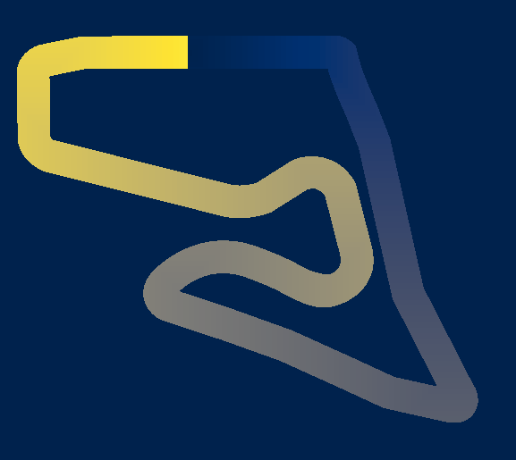
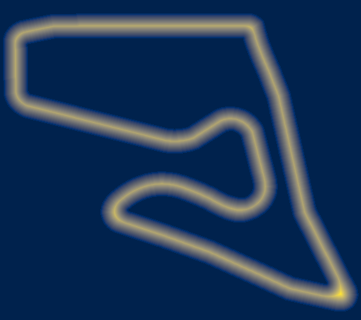
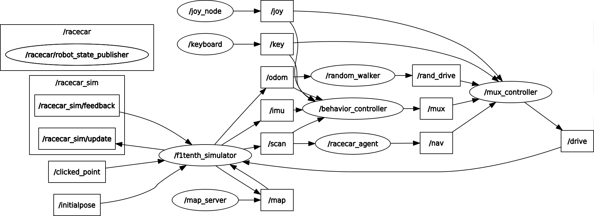
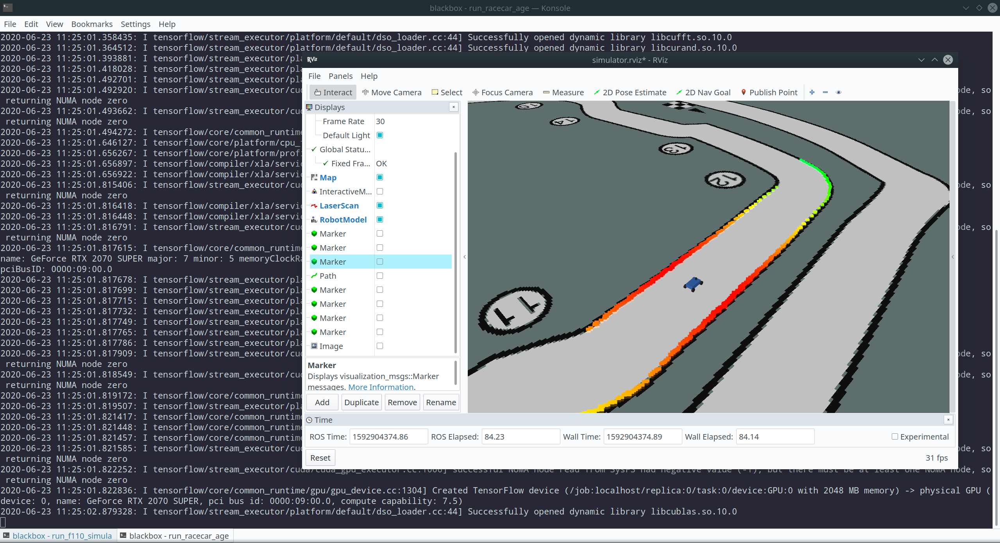

**VU Autonomous Racing Cars (2020S) - TU Wien**

**Team 3**

Stefan Adelmann | Hannes  Brantner | Daniel Lukitsch | Thomas Pintaric

------

# Lab 8: Reinforcement Learning

The eigth lab assignment had two distinct parts:

1. The first part was to modify the existing but buggy [**f1tenth_gym**](https://github.com/f1tenth/f1tenth_gym) to our needs, to write a meaningful reward function that correctly shapes the agent policy, to define observation space and action space and to tune various parameters while training.
2. The second part was to test the trained model in a deployed ROS node, which was running inside the standard [**f1tenth_simulator**](https://github.com/f1tenth/f1tenth_simulator).

## Building and Running

As the standard ROS Melodic installation only supports Python 2, and our reinforcement learning framework [**Tensorforce**](https://github.com/tensorforce/tensorforce) only supports Python 3, we compiled a minimal ROS Melodic installation that supports Python 3 using the following scripts:

At first, change the current working directory to **lab8/ros** and verify that you have [**pyenv**](https://github.com/pyenv/pyenv) with Python 3.7.6 installed (**check_prerequisites.sh**). Then execute **build_ros.sh** to build a minimal ROS Melodic installtion with Python 3 support. Then execute the scripts **build_f110_simulator.sh** and **build_racecar_agent.sh** to build all required executables. After that execute **run_f110_simulator.sh** to start the simulator and then execute **run_racecar_agent.sh** to start our racecar agent for testing. There is also a **clean<span>.sh</span>** scripts that removes all the files that were generated by the above scripts.

## Implementation details

### Training

Before the training script is started the required Python dependencies must be installed. This can be done with the following command:
```bash
pip install -r lab8/gym/requirements.txt
```

We used the **PPO** agent from [**Tensorforce**](https://github.com/tensorforce/tensorforce) consisting of a convolutional neural network with two hidden layers each consisting of 64 neurons. The batch size was taken to be 10, therefore the parameters in the neural net are updated every tenth timestep. The agent was also initialized to introduce a little bit of action noise to enable a better state exploration in the long term.

The racecar agent was trained with a modified [f1tenth_simulator](https://github.com/pintaric/f1tenth_simulator) and a modified [f1tenth_gym](https://github.com/pintaric/f1tenth_gym) because the given sources were incomplete. The standard simulator used single-step forward integration to integrate the vehicle dynamics, but our modified simulator uses the Runge-Kutta Dormand-Prince method to integrate, which provides a much tighter error bound than the first one. The action space was continuous and the borders were passed with a parameter file. The number of laser scans that are observed can also be changed via a parameter in the respective file, but the default was to take every ninth ray resulting in 120 rays. The model was trained with the Python script **lab8/gym/train_with_tensorforce.py**. The reward per step is equivalent to the **driven_distance** added with the squared **distance_from_obstacle**, which are both read out by the position of the car in the simulator from the following cost maps:



The above costmap described the distance in the direction of the goal that has been covered by the current position of the car.



The above costmap described the distance to the nearest obstacle by the current position of the car.
These costmaps can be creates fully automatic by running the script **lab8/costmaps/process_all_maps.bash**.

If the car crashes into a wall the reward is decreased by 1000 and the episode is stopped. If the car travels more than 98% of the normalized driven distance, which is just the current driven distance according to the map divided by the maximum driven distance in the costmap, our algorithm detects a lap completion, increases the last reward by 1000000 and stops the current episode. The agent itself stops training after 10000 steps without completion of the current episodes. The training can only be stopped via a keyboard interrupt, but the model should be trained at least for 3000 episodes.

The following video shows the state space exploration during training:

<video controls>
  <source src="../slack/exploration_during_training.mp4" type="video/mp4">
</video>

### Testing

Our racecar agent automatically reads the shape of the observation space from the loaded [**Tensorforce**](https://github.com/tensorforce/tensorforce) model and subsamples the lidar scan accordingly to match the read shape. The racecar agent passes the correctly subsampled lidar scan to the model and asks it for the steering angle considering only the current observation. This steering angle is packed into a **AckermannDriveStamped** message where the steering angle is set accordingly to the model output and the velocity was fixed to **1m/s**. The racecar agent was tested on the map **f1_mco.yaml**, which is different to the map the model was trained (**f1_aut.yaml**) to also test the ability to generalize of the model. It should be considered that the Austrian map does not contain turnes as sharp as the Monaco map, therefore our agent crashes at sharp turnes, as you can see below.

The following picture shows the ROS Node Graph of our described configuration:



The next picture shows the racecar agent driving the car inside the simulator:



The following video shows the performance of the trained agent on the **f1_mco.yaml** racemap:

<video controls>
  <source src="../slack/driving_video.mp4" type="video/mp4">
</video>

As can be seen in the previous video, the model generalizes pretty good and even avoids artificially added obstacles on the track. Nonetheless, the agent crashes in corner 5, because the track used for training has not contained such steep curves.