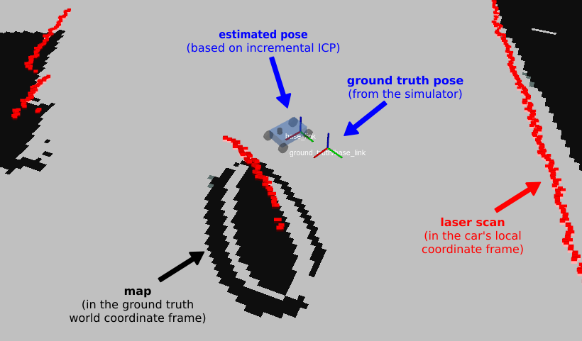

**VU Autonomous Racing Cars (2020S) - TU Wien**

**Team 3**

Stefan Adelmann | Hannes  Brantner | Daniel Lukitsch | David Lung | Thomas Pintaric

------

# Lab 5: Scan Matching

### ROS Package & Node

The submitted ROS package is named **group3_lab5** and contains the node `scan_matcher`, which  implements the [PLICP algorithm](https://censi.science/research/robot-perception/plicp/) from [[Censi 2008]](http://dx.doi.org/10.1109/ROBOT.2008.4543181).

### Implementation details

<u>The two core parts of the PLICP algorithm are:</u>

- **Correspondence finding** (implemented in [src/scan_matcher/correspond.cpp](src/scan_matcher/correspond.cpp)), and
- **Transform estimation** (implemented in [src/scan_matcher/transform.cpp](src/scan_matcher/transform.cpp)).

In general, our implementation closely follows [[Censi 2008]](http://dx.doi.org/10.1109/ROBOT.2008.4543181). We apply two separate outlier rejection techniques to the list of candidate correpondences: First, any point () is allowed to appear in at most one matched pair. Should a point get matched multiple times, only the minimal-distance match is retained. Second, the "worst" (w.r.t. matching distance) n-th percentile of inliers is always trimmed (where n is an adjustable parameter) from the final list of correpondences.

For the transform estimation, we replaced the provided "homebrew" polynomial solver code with `Eigen::PolynomialSolver` (from `<unsupported/Eigen/Polynomials>`).

We further altered the provided template code in the following ways:

- The ground truth pose (`/gt_pose`) published by the F1tenth simulator gets republished into the TF tree as `/tf/ground_truth/base_link`.
- Our `scan_matcher` node acts as a **stand-alone odometry estimator** by performing incremental laser scan matching (using PLICP). Each laser scan is compared to a previous scan. The transformation  between the two scans is aggregated over time to calculate the position of the racecar in the fixed frame. The result is published by our `scan_matcher` node as `/tf/base_link`.
- In `RViz`, the racecar model is drawn at the estimated (not the ground-truth) position, as shown in the annotated screenshot below:




#### Unit tests (correctness tests)

To verify the correctness of the implemented algorithms, stand-alone unit tests (without dependencies on ROS) were implemented in [test/test_icp_algorithm.cpp](test/test_icp_algorithm.cpp) (using the [GoogleTest framework](https://github.com/google/googletest)).

A stand-alone test (`TestICP.check_full_algorithm`) uses synthetically generated laser scans as input data. The following image shows an example of an input dataset (generated by overlaying multiple sine curves):


The generated laser scans are translated and rotated at random. Afterwards, PLICP is applied to recover the (known) transformation. A test passes, if the recovered transformation is identical (within some ) to the initial (known) transformation.

This is repeated multiple times (at random, but with a fixed seed for repeatability).

For the submitted code archive, all tests pass:


------

Our code was tested against [ROS Melodic](http://wiki.ros.org/melodic) (from the [official package repository](http://wiki.ros.org/melodic/Installation/Ubuntu)) under [Ubuntu 18.04 LTS](http://releases.ubuntu.com/18.04.4/).

### How to run the code

First, setup your catkin workspace. We assume that [ROS Melodic is already installed](http://wiki.ros.org/melodic/Installation/Ubuntu) on the system and that the workspace location is stored in the environment variable `${ROS_LAB_WORKSPACE}`.

```bash
source /opt/ros/melodic/setup.bash
mkdir -p ${ROS_LAB_WORKSPACE}/src
cd ${ROS_LAB_WORKSPACE}
catkin init --workspace ${ROS_LAB_WORKSPACE}

# Clone the new f1tenth_labs repository and remove the lab/project skeletons
git clone https://github.com/f1tenth/f1tenth_labs.git \
	${ROS_LAB_WORKSPACE}/src/f1tenth_labs
find ./src/f1tenth_labs -maxdepth 1 -type d -iname 'lab?' -or -iname 'project' | \
	xargs rm -rf	

# Unpack this submission into the catkin workspace
tar -xzf group5_lab5.tar.gz --directory=${ROS_LAB_WORKSPACE}/src

# Build all packages (Release)
catkin build --workspace ${ROS_LAB_WORKSPACE} -DCMAKE_BUILD_TYPE=Release
source ${ROS_LAB_WORKSPACE}/devel/setup.bash
```

Launch the `f110_simulator` from [f1tenth](https://github.com/f1tenth) / **[f1tenth_labs](https://github.com/f1tenth/f1tenth_labs)** using the included launch script [launch/simulator.launch](launch/simulator.launch).

```bash
roslaunch group3_lab5 simulator.launch
```

In a separate console, start the `scan_matcher` node using the included launch script [launch/scan_matcher.launch](launch/scan_matcher.launch).

```bash
roslaunch group3_lab5 scan_matcher.launch
```

<u>Expected result:</u>


### Analysis of results

To assess the performance of our PLICP implementation, we conducted three separate experiments (see below). During those experiments, we drove various maneuvers with the simulated racecar and recorded all `\tf` messages into ROS .bag files for later analysis.

To review our data analysis, launch the `PlotJuggler` and start playback of a pre-recorded .bag file from the included launch script [launch/offline_analysis.launch](launch/offline_analysis.launch).

```bash
# EXPERIMENT 1: Driving in a straight line
roslaunch group3_lab5 offline_analysis.launch bag_file:=line.bag

# EXPERIMENT 2: Driving in a circle
roslaunch group3_lab5 offline_analysis.launch bag_file:=circle.bag

# EXPERIMENT 3: Free driving (default)
roslaunch group3_lab5 offline_analysis.launch bag_file:=free.bag
```

When prompted, confirm to *"start the previously used streaming plugin"* and select the topics `/gt_pose` and `/tf` from the list, as shown in the screenshot below:


#### <u>Experiment 1:</u> Driving in a straight line


#### <u>Experiment 2:</u> Driving in a circle


#### <u>Experiment 3:</u> Free driving


### Conclusions

Our implemented method is based on **pairwise (frame-incremental) registration** of laser range scans. As such, it suffers from increasingly worse precision over time, due to the **accumulation of small estimation errors** at every time step.

The analysis of the data obtained from three experiments (using PlotJuggler, see above) has shown that orientation errors tend to be more problematic than translation errors. (In fact, even minimal orientation errors will result in large translation errors over time.)

Various techniques can be found in the literature to mitigate this effect, for example:

- By matching against an incrementally built map, the pose estimates can be corrected when encountering previously visited locations. [[Grisetti, Stachniss, and Burgard, 2007]](https://openslam-org.github.io/gmapping.html)
- Use sensor fusion to combine the laser range scans with estimates from other sensors, such as an inertial measurement unit (IMU), or the racecar's wheel encoders.
- Use signal processing (e.g. lowpass filtering) to reduce noise in the laser range scans prior to registration.

However, those techniques are beyond the scope of this lab assignment.