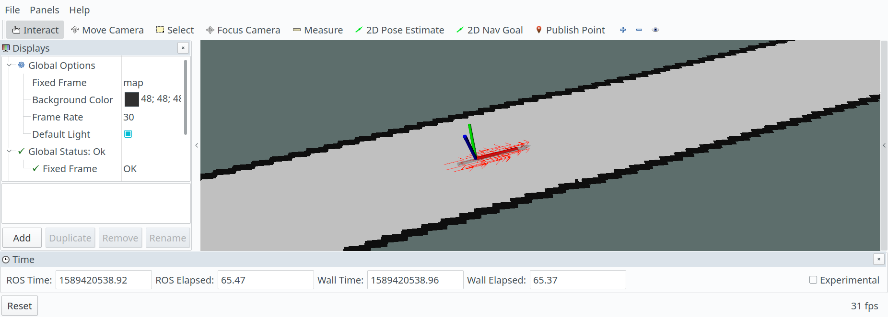
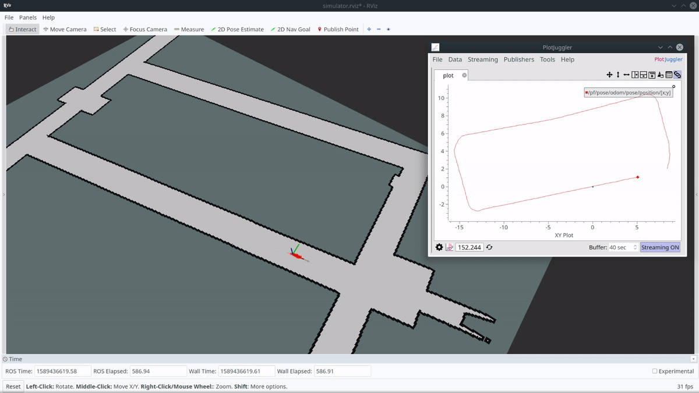
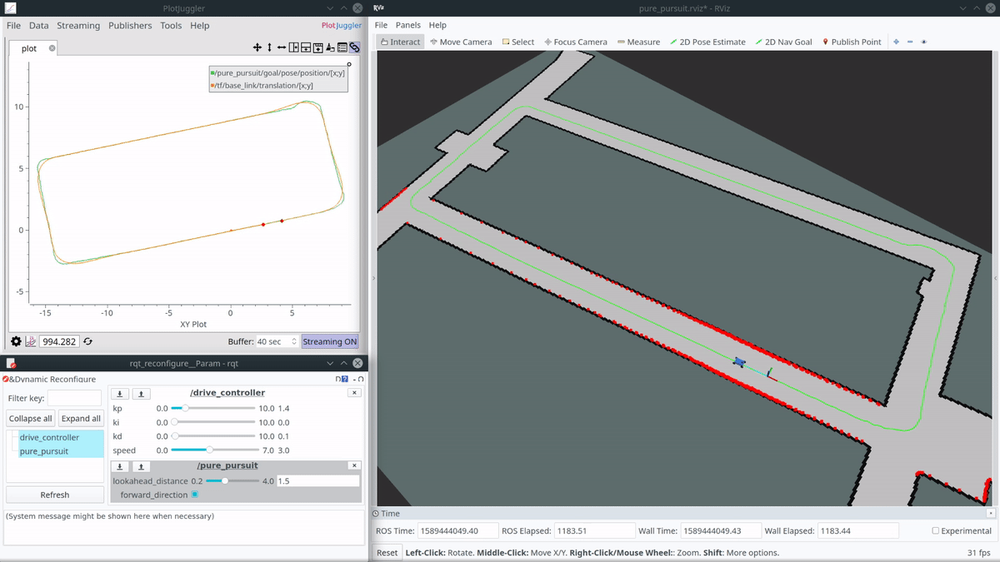
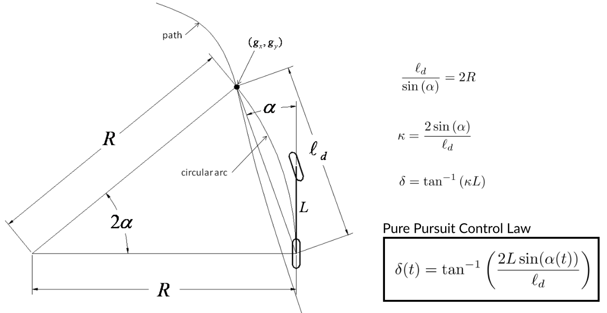

**VU Autonomous Racing Cars (2020S) - TU Wien**

**Team 3**

Stefan Adelmann | Hannes  Brantner | Daniel Lukitsch | Thomas Pintaric

------

# Lab 6: Pure Pursuit

The sixth lab assignment had three distinct parts:

1. We used [Google's Cartographer](https://opensource.google/projects/cartographer) to generate a map of an indoor environment from laser range scans. (Not on a physical racecar, but from simulated data. In our case, we re-mapped the ["Levine loop"](https://github.com/f1tenth/f1tenth_labs/blob/master/f110_simulator/maps/levine.yaml), which is provided as part of the F1tenth simulator package.)
2. We used an existing [Particle Filter implementation](https://github.com/mit-racecar/particle_filter) to localize our (simulated) vehicle inside the re-mapped "Levine loop" environment, drove the car around the track using keyboard controls and **logged the driven trajectory** into a CSV file.  (All of this was done entirely in simulation as well.)
3. We implemented the Pure Pursuit Control Law (as described in [[Snider 2009]](https://www.ri.cmu.edu/pub_files/2009/2/Automatic_Steering_Methods_for_Autonomous_Automobile_Path_Tracking.pdf)) as a ROS node and created a **trajectory-following demo** (from the logged trajectory of the previous step).

## Implementation details

### Mapping (with Cartographer)

To avoid topic collisions with the simulator, we first recorded a `.bag` file (using [Rosbag](http://wiki.ros.org/rosbag), containing the topics `/tf` and `/scan`) while driving around the simulated "Levine loop". We then ran [Cartographer](https://opensource.google/projects/cartographer) on a playback of this recording to (re-)estimate the map using GraphSLAM.

The re-mapped "Levine loop" was saved to `maps/remapped_levine_loop.yaml`.


### Localization (with a Particle Filter) & Waypoint Logging

A stand-alone demonstration of **particle filter-based self-localization** using our reconstructed *"Levine loop"* map can be started by launching `launch/simulate_remapped_environment.launch`.






If should be noted that we did not fine-tune the particle filter's parameters to our specific noise model (which should be done for a real-world application), but instead used the implementation's default parameters.

We then drove the car around the track using keyboard/gamepad controls and **logged the driven trajectory** into a CSV file (using the `waypoint_logger.py` node provided as part of the F1tenth code repository). 


### Pure Pursuit

**TODO:** Description here...




**TODO:** Description here...




------

Our code was tested against [ROS Melodic](http://wiki.ros.org/melodic) (from the [official package repository](http://wiki.ros.org/melodic/Installation/Ubuntu)) under [Ubuntu 18.04 LTS](http://releases.ubuntu.com/18.04.4/).

### How to run the code

First, setup your catkin workspace. We assume that [ROS Melodic is already installed](http://wiki.ros.org/melodic/Installation/Ubuntu) on the system and that the workspace location is stored in the environment variable `${ROS_LAB_WORKSPACE}`.

```bash
source /opt/ros/melodic/setup.bash
mkdir -p ${ROS_LAB_WORKSPACE}/src
cd ${ROS_LAB_WORKSPACE}
catkin init --workspace ${ROS_LAB_WORKSPACE}

# Clone the new f1tenth_labs repository and remove the lab/project skeletons
git clone https://github.com/f1tenth/f1tenth_labs.git \
	${ROS_LAB_WORKSPACE}/src/f1tenth_labs
find ./src/f1tenth_labs -maxdepth 1 -type d -iname 'lab?' -or -iname 'project' | \
	xargs rm -rf	

# Clone the particle_filter repository
# Note that it might be necessary to install range_libc for the particle filter to work.
# See: https://github.com/kctess5/range_libc
git clone https://github.com/mit-racecar/particle_filter.git \
	${ROS_LAB_WORKSPACE}/src/particle_filter

# Unpack this submission into the catkin workspace
tar -xzf group3_lab6.tar.gz --directory=${ROS_LAB_WORKSPACE}/src

# Build all packages (Release)
catkin build --workspace ${ROS_LAB_WORKSPACE} -DCMAKE_BUILD_TYPE=Release
source ${ROS_LAB_WORKSPACE}/devel/setup.bash
```

#### Mapping (with Cartographer)

**TODO:** Description here...

#### Localization (with a Particle Filter) & Waypoint Logging

<u>Terminal 1:</u>

```bash
roslaunch group3_lab6 simulate_remapped_environment.launch
```

<u>Terminal 2:</u>

```bash
rosrun group3_lab6 waypoint_logger.py
```

#### Pure Pursuit

<u>Terminal 1:</u>

```bash
roslaunch group3_lab6 pure_pursuit_simulator.launch
```

<u>Terminal 2:</u>

```bash
roslaunch group3_lab6 pure_pursuit.launch
```
