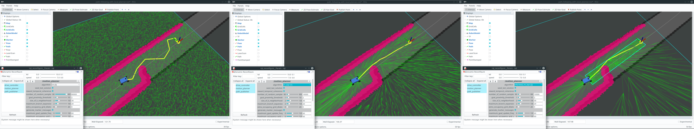
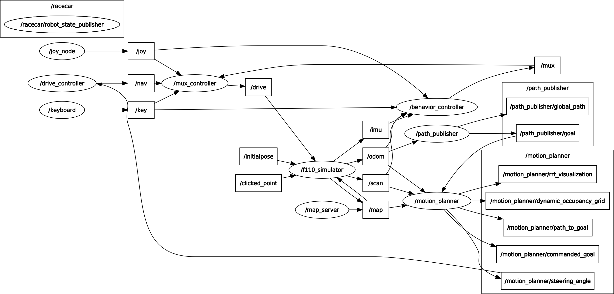

**VU Autonomous Racing Cars (2020S) - TU Wien**

**Team 3**

Stefan Adelmann | Hannes  Brantner | Daniel Lukitsch | Thomas Pintaric

------

# Lab 7: Motion Planning

**For this lab, we implemented the following three path planning algorithms:

- RRT
- RRT*
- Informed-RRT* [[Gammel et al. 2014]](https://arxiv.org/abs/1404.2334)



<u>Figure:</u> From left to right: RRT, RRT\*, Informed-RRT\*.

------

Our code was tested against [ROS Melodic](http://wiki.ros.org/melodic) (from the [official package repository](http://wiki.ros.org/melodic/Installation/Ubuntu)) under [Ubuntu 18.04 LTS](http://releases.ubuntu.com/18.04.4/).

### How to run the code

First, setup your catkin workspace. We assume that [ROS Melodic is already installed](http://wiki.ros.org/melodic/Installation/Ubuntu) on the system and that the workspace location is stored in the environment variable `${ROS_LAB_WORKSPACE}`.

```bash
source /opt/ros/melodic/setup.bash
mkdir -p ${ROS_LAB_WORKSPACE}/src
cd ${ROS_LAB_WORKSPACE}
# Initialize the workspace
catkin config --init --workspace ${ROS_LAB_WORKSPACE} \
    --cmake-args -DCMAKE_BUILD_TYPE=Release

# Clone the new f1tenth_labs repository and remove the lab/project skeletons
git clone https://github.com/f1tenth/f1tenth_labs.git \
	${ROS_LAB_WORKSPACE}/src/f1tenth_labs
find ./src/f1tenth_labs -maxdepth 1 -type d -iname 'lab?' -or -iname 'project' | \
	xargs rm -rf	

# Unpack this submission into the catkin workspace
tar -xzf group3_lab7.tar.gz --directory=${ROS_LAB_WORKSPACE}/src

# Build all packages
catkin build --workspace ${ROS_LAB_WORKSPACE}
source ${ROS_LAB_WORKSPACE}/devel/setup.bash
```

### Demo



<u>A ROS demo of all three algorithms can be launched as follows:</u>

Terminal #1:

```bash
roslaunch group3_lab7 path_following_with_local_planner.launch
```

Terminal #2:

```bash
roslaunch group3_lab7 rviz.launch
```

**<u>WARNING:</u>** We discovered that the current apt-packaged version of RViz (1.13.12-1bionic.20200506.140253) will mishandle nav_msgs::OccupancyGrid messages, causing it to to crash. In order to run our demo, it may be neccesary to **rebuild RViz from source** (https://github.com/ros-visualization/rviz, "melodic-devel" branch) and link it against **OGRE 1.9.1** (https://github.com/OGRECave/ogre.git).