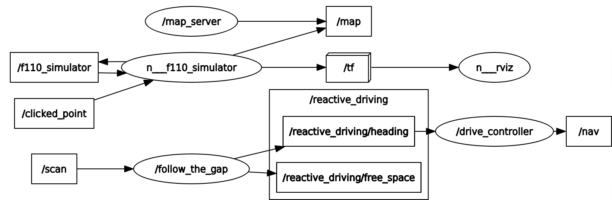

**VU Autonomous Racing Cars (2020S) - TU Wien**
Thomas Pintaric (09620608)

# Lab 4: Reactive Driving

### ROS Package & Nodes

The submitted ROS package (**pintaric_lab4**) contains <u>two separate ROS nodes</u>:

- `follow_the_gap.py` (Python implementation) subscribes to `/scan` (LaserScan messages, containing LIDAR samples), computes a best-effort obstacle-free heading, and publishes the requested heading angle to `/reactive_driving/heading` (Float32 messages, containing the angle w.r.t. the vehicle's forward direction).

  <u>Implementation notes:</u>

  The implemented gap avoidance method is only loosely based on the *"F1TENTH Follow the Gap"* algorithm from the exercise description. It works as follows:

  - "Gaps" are **discontinuities in the first-order derivative of forward LIDAR range measurements** (where "forward" means -90° to +90°), on condition that they are...

    - maximal within a sliding window, and
    - greater than the local median multiplied by a threshold.

  - All LIDAR range measurements in the immediate "neighborhood" of a gap (where the size of the neighborhood depends on the vehicle's width/wheelbase) are **clipped to a maximum of the gap's measured range**.

    

  - Finally, the vehicle's heading angle is computed as the **average of LIDAR scanning angles in the n-th percentile of range measurements** (where n~85%). 

  Source code: [src/follow_the_gap.py](src/reactive_gap_follow.py)

- `drive_controller.py` (Python implementation) subscribes to `/reactive_driving/heading` (Float32 messages, containing the heading angle w.r.t. the vehicle's forward direction). The heading angles are fed into a PID controller (the controller's tuning parameters Kp, Ki, Kd can be set at runtime via `dynamic_reconfigure` or `rqt_reconfigure`) as steady-state error input. The vehicle's steering angle is computed from the PID control output and published to `/nav`.
  Source code: [src/drive_controller.py](src/drive_controller.py)

### ROS Dataflow Graph



------

The code was tested with [ROS Melodic](http://wiki.ros.org/melodic) under [Ubuntu 18.04 LTS](http://releases.ubuntu.com/18.04.4/).

### How to run the code

First, setup the catkin workspace. We assume that [ROS Melodic is already installed](http://wiki.ros.org/melodic/Installation/Ubuntu) on the system and that the workspace location is stored in the environment variable `${ROS_LAB_WORKSPACE}`.

```bash
source /opt/ros/melodic/setup.bash
mkdir -p ${ROS_LAB_WORKSPACE}/src
cd ${ROS_LAB_WORKSPACE}
catkin config --init --workspace ${ROS_LAB_WORKSPACE} \
    --cmake-args -DCMAKE_BUILD_TYPE=Release

# Clone the new f1tenth_labs repository and remove the lab/project skeletons
git clone https://github.com/f1tenth/f1tenth_labs.git \
	${ROS_LAB_WORKSPACE}/src/f1tenth_labs
find ./src/f1tenth_labs -maxdepth 1 -type d -iname 'lab?' -or -iname 'project' | \
	xargs rm -rf	

# Unpack the submission into the catkin workspace
tar -xzf pintaric_lab4.tar.gz --directory=${ROS_LAB_WORKSPACE}/src

# Build all packages
catkin build --workspace ${ROS_LAB_WORKSPACE}
source ${ROS_LAB_WORKSPACE}/devel/setup.bash
```

Launch `f110_simulator` from [f1tenth](https://github.com/f1tenth) / **[f1tenth_labs](https://github.com/f1tenth/f1tenth_labs)** using the included launch script [launch/simulator.launch](launch/simulator.launch).

```bash
roslaunch pintaric_lab4 simulator.launch
```

In a separate console, launch `follow_the_gap.py` and  `drive_controller.py` using the included launch script [launch/follow_the_gap.launch](launch/follow_the_gap.launch).

```bash
roslaunch pintaric_lab4 follow_the_gap.launch
```

Expected result:


Turn "Navigation" on (by pressing `n` in the simulator console) and increase the vehicle speed (using the `speed` slider in the Dynamic Reconfigure GUI, as shown above) to start driving.